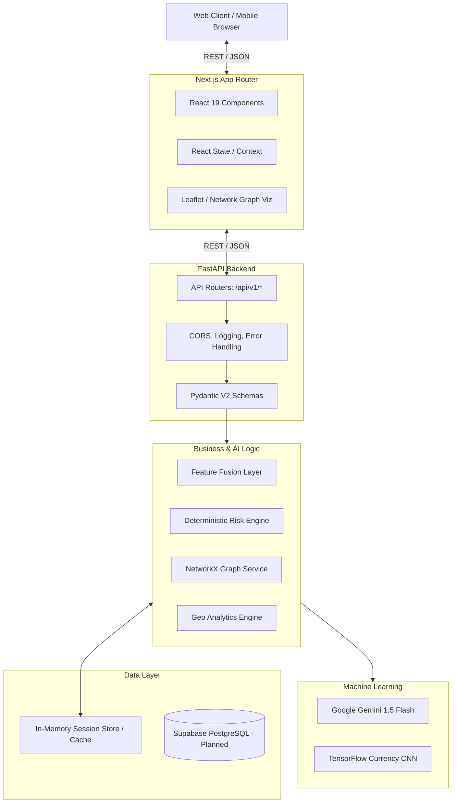
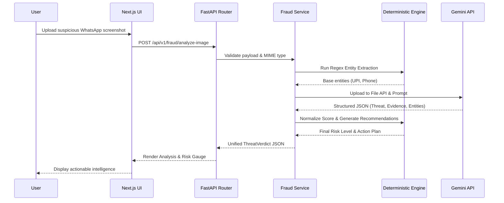
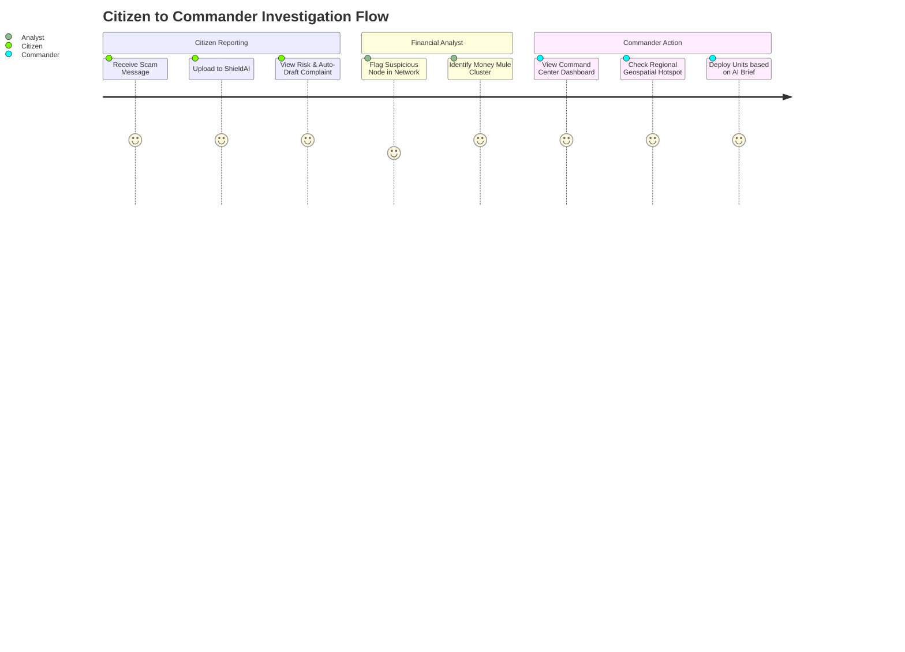

<div align="center">

# 🛡️ ShieldAI

**AI-Powered Digital Public Safety Intelligence Platform**

*Detect • Prevent • Protect*

[](https://nextjs.org/)
[](https://react.dev/)
[](https://fastapi.tiangolo.com/)
[](https://python.org/)
[](https://tensorflow.org/)
[](https://deepmind.google/technologies/gemini/)
[](https://networkx.org/)
[](https://opensource.org/licenses/MIT)

---

ShieldAI is a unified, hybrid-AI intelligence platform designed to combat the explosion of digital fraud. By combining probabilistic Generative AI (Google Gemini) with deterministic machine learning (TensorFlow) and graph analytics (NetworkX), ShieldAI provides explainable, real-time threat intelligence for citizens, financial analysts, and law enforcement commanders.

</div>

---

## 📑 Table of Contents

- [Project Overview](#project-overview)
- [Live Demo](#live-demo)
- [Features](#features)
- [System Architecture](#system-architecture)
- [Data Flow Diagram](#data-flow-diagram)
- [User Journey](#user-journey)
- [Project Architecture](#project-architecture)
- [Technology Stack](#technology-stack)
- [AI Stack](#ai-stack)
- [Backend Architecture](#backend-architecture)
- [Frontend Architecture](#frontend-architecture)
- [Database Design](#database-design)
- [Security Architecture](#security-architecture)
- [Performance Optimizations](#performance-optimizations)
- [Installation](#installation)
- [Environment Variables](#environment-variables)
- [API Documentation](#api-documentation)
- [Performance Metrics](#performance-metrics)
- [Testing](#testing)
- [Deployment Architecture](#deployment-architecture)
- [Roadmap](#roadmap)

---

## 🎯 Project Overview

### The Problem
Citizens are facing highly sophisticated digital scams (e.g., "Digital Arrests", phishing, fake UPI requests). Traditional law enforcement is reactive—investigations begin *after* the financial loss occurs. Analysts struggle with fragmented data, manual evidence review, and an inability to visualize organized fraud networks across state lines.

### The Solution: ShieldAI
ShieldAI shifts public safety from **reactive investigation** to **proactive protection**. It offers a multi-modal platform consisting of 5 core modules:
1. **Citizen Fraud Shield**: Real-time analysis of SMS, WhatsApp, voice, and images.
2. **Currency Verification**: Dual-AI counterfeit detection.
3. **Fraud Network Analysis**: Graph-based visualization of money laundering rings.
4. **Geospatial Crime Intelligence**: Interactive mapping and AI deployment recommendations.
5. **Investigation Command Center**: A unified dashboard aggregating all intelligence.

### The Innovation: Hybrid AI
Relying solely on LLMs for public safety is dangerous due to hallucinations. ShieldAI utilizes a **Hybrid AI Architecture**:
* **Generative AI** (Gemini) handles unstructured data, narrative generation, and complex multimodal feature extraction.
* **Deterministic Engines** handle regex entity extraction, risk score normalization, mathematical graph density, and recommendations.

---

## 🚀 Live Demo

* **Local Environment:** `http://localhost:3000`
* **API Documentation:** `http://localhost:8000/docs` (Swagger UI)
* *Live Deployment: Not Yet Implemented (Local configuration provided)*

---

## ✨ Features

### 🛡️ Citizen Features
* **Multi-Modal Threat Analysis:** Upload text, voice, or screenshots of suspicious activity.
* **Explainable Risk Scoring:** 0-100 score normalized by a deterministic risk engine.
* **Entity Extraction:** Safely extracts phone numbers, UPI IDs, and URLs with copy-to-clipboard functionality.
* **Auto-Complaint Generation:** Transforms the threat analysis into a formal complaint ready for the National Cybercrime Portal.

### 🏦 Financial / Analyst Features
* **Currency Verification:** Upload banknotes for TensorFlow authenticity classification and Gemini-powered security feature verification.
* **Fraud Network Graphing:** Upload transaction CSVs to generate force-directed network graphs.
* **Community Detection:** Automatically identifies "Money Mules" and "Suspected Coordinators" based on in/out degree centrality.

### 🚔 Law Enforcement Command Features
* **Geospatial Hotspots:** Grid-based spatial indexing of crime incidents across India.
* **AI Deployment Recommendations:** Automated resource allocation suggestions based on regional threat density.
* **Unified Command Dashboard:** Cross-module activity feed, priority case queues, and operational analytics.

---

## 🏛️ System Architecture



---

## 🔄 Data Flow Diagram



---

## 🗺️ User Journey



---

## 📁 Project Architecture

The repository is built as a monorepo containing a Next.js frontend and a FastAPI backend.

```text
sdk/
├── src/                          # Next.js Frontend
│   ├── app/                      # App Router (pages: /citizen, /currency, /network, etc.)
│   ├── components/               # UI Components
│   │   ├── ui/                   # Shared Primitives (Radix UI, Tailwind)
│   │   ├── sections/             # Landing page modular sections
│   │   ├── citizen/              # Fraud Shield components
│   │   ├── network/              # Graph & Dataset components
│   │   ├── geospatial/           # Map & Filter components
│   │   └── command-center/       # Dashboard & Queue components
│   └── lib/                      # Types & API Service wrappers
├── backend/                      # FastAPI Backend
│   ├── app/
│   │   ├── api/                  # Route controllers (fraud.py, geo.py, network.py)
│   │   ├── core/                 # Config (Pydantic BaseSettings) & Logging
│   │   ├── middleware/           # CORS, Request Timing, Exception Handlers
│   │   ├── models/               # (Planned) ORM Models
│   │   ├── prompts/              # Versioned text prompts for Gemini
│   │   ├── schemas/              # Pydantic validation schemas
│   │   ├── services/             # Core business logic (AI wrappers, graph builders)
│   │   └── utils/                # Response envelopes, upload handlers
│   ├── data/                     # Local knowledge bases (currency_features.json)
│   ├── tests/                    # Pytest suite
│   └── main.py                   # Uvicorn entrypoint
```

---

## 💻 Technology Stack

| Logo | Technology | Version | Purpose | Why Chosen |
|---|---|---|---|---|
|  | **Next.js** | 16.2.10 | Frontend Framework | App router, built-in optimizations, seamless React 19 support. |
|  | **React** | 19.2.4 | UI Library | Component-based architecture, highly interactive workspaces. |
|  | **Tailwind CSS** | 4.x | Styling | Rapid utility-first UI development, robust dark-mode. |
|  | **FastAPI** | 0.115+ | Backend API | Async native, automatic OpenAPI docs, incredible execution speed. |
|  | **Python** | 3.12+ | Backend Language | Unmatched ecosystem for Data Science, Graph Analytics, and AI. |

---

## 🧠 AI Stack

ShieldAI employs a robust multi-model strategy to balance reasoning, vision, and deterministic classification.

| Engine | Technology | Purpose in ShieldAI | Implementation Details |
|---|---|---|---|
| **LLM / Reasoning** | Gemini 1.5 Flash | Threat narrative generation, complaint drafting | Forced structured JSON output via `google-genai` SDK. |
| **Vision AI** | Gemini 1.5 Pro/Flash | Currency feature extraction, tampered screenshot detection | Multimodal processing via Gemini File API uploads. |
| **Speech** | Gemini 1.5 Flash | Voice scam / vishing transcript analysis | Audio file ingestion for urgency/fear detection. |
| **Classification** | TensorFlow CNN | Base counterfeit currency detection | 224x224 RGB image tensors classified via a Teachable Machine trained model. |
| **Graph Analytics** | NetworkX | Fraud ring and money mule detection | Computes connected components, in/out degree centrality across transaction matrices. |

---

## ⚙️ Backend Architecture

The backend follows a strict **3-Layer Architecture** (Routes → Services → Data/AI Models).

*   **Controllers (Routes):** Found in `backend/app/api/`. Strictly responsible for handling HTTP requests, leveraging FastAPI's dependency injection, and returning standard JSON envelopes.
*   **Services:** Found in `backend/app/services/`. This is where the core logic lives (e.g., `GeminiFraudService`, `NetworkGraphService`, `GeoAnalyticsService`).
*   **Middleware:** Found in `backend/app/middleware/`. Implements Request ID generation, processing time logging, and global exception handling to prevent stack traces from leaking.
*   **Validation:** Driven purely by Pydantic V2 (`backend/app/schemas/`), ensuring malformed requests never reach the AI or processing engines.
*   **Caching:** In-memory LRU caching (`network_cache.py`, `geo_store.py`) ensures that heavy graph computations or map generations aren't re-run redundantly during the same session.

---

## 🎨 Frontend Architecture

*   **Pages:** Structured via Next.js App Router (`/citizen`, `/network`, `/geospatial`).
*   **Components:** Modular UI fragments organized by feature domain (`src/components/network/`, `src/components/currency/`).
*   **State Management:** React hooks (`useState`, `useMemo`, `useEffect`) scoped at the page level and passed down to deterministic UI panels.
*   **Animations:** Powered by Framer Motion (`src/components/motion.tsx`) for fluid interactions (FadeIn, StaggerContainers).
*   **Design System:** Built on Tailwind CSS with custom thematic tokens (`shield-navy`, `shield-cyan`, `shield-high-risk`), utilizing Radix UI primitives and `class-variance-authority` (CVA) for scalable component variants.

---

## 🗄️ Database Design

*Note: Database integration is marked as **Not Yet Implemented (Planned)**. The platform currently utilizes an optimized in-memory session store for hackathon evaluation speed.*

**Planned Schema (Supabase PostgreSQL):**
*   `users`: Law enforcement & analyst authentication.
*   `threat_reports`: Logs of citizen queries and AI verdicts.
*   `network_datasets`: Stored CSV mappings and computed graph state.
*   `geo_incidents`: Spatial table (PostGIS) containing raw incident data.

---

## 🔒 Security Architecture

*   **Standardized Validation:** All API inputs are strictly typed via Pydantic. Files are validated by MIME type and size (`app/utils/upload.py`) before processing.
*   **Secure Headers & CORS:** Configurable via `.env` (`CORS_ORIGINS`). Implemented via FastAPI middleware.
*   **Secrets Management:** AI Keys and environment configurations are strictly managed via `pydantic-settings` (`core/config.py`).
*   *Authentication / Authorization / Rate Limiting: Not Yet Implemented (Mock routes exist in `/api/v1/auth`).*

---

## ⚡ Performance Optimizations

*   **Retry Mechanisms:** AI integrations utilize `tenacity` for exponential backoff (e.g., handling Gemini API rate limits gracefully).
*   **Concurrent Async:** FastAPI routes utilize Python's `asyncio` to prevent IO blocking during file uploads or AI network requests.
*   **Frontend Lazy Loading:** Heavy visual components (like the Leaflet map in `CybercrimeThreatMap` and Network graphs) are dynamically imported with SSR disabled (`next/dynamic`) to ensure fast Initial Page Loads.
*   **Structured AI Output:** We force Gemini to return strict JSON (`response_mime_type="application/json"`), bypassing the need for slow, error-prone regex parsing of LLM text outputs.

---

## 📦 Installation

### Requirements
*   Node.js 20+
*   Python 3.12+
*   Google Gemini API Key

### Step 1: Clone the repository
```bash
git clone https://github.com/your-org/shieldai.git
cd shieldai
```

### Step 2: Setup Frontend
```bash
npm install
npm run dev
# The frontend will be available at http://localhost:3000
```

### Step 3: Setup Backend
```bash
cd backend
python -m venv venv
# Windows:
venv\Scripts\activate
# macOS/Linux:
# source venv/bin/activate

pip install -r requirements.txt
cp .env.example .env
```
*Edit `.env` and add your `GEMINI_API_KEY`.*

```bash
python main.py
# The backend will be available at http://localhost:8000
```

---

## 🔐 Environment Variables

Create a `.env` file in the `backend/` directory based on `.env.example`:

| Name | Purpose | Required | Default |
|---|---|---|---|
| `APP_NAME` | API Title | No | `ShieldAI` |
| `ENVIRONMENT` | Runtime context | No | `development` |
| `API_V1_PREFIX` | Route prefixing | No | `/api/v1` |
| `CORS_ORIGINS` | Security allowlist | No | `["http://localhost:3000"]` |
| `UPLOAD_DIR` | Temp file storage | No | `uploads` |
| `LOG_LEVEL` | Verbosity | No | `INFO` |
| `GEMINI_API_KEY` | Google AI Auth | **Yes** | `null` |
| `GEMINI_MODEL` | Target AI Model | No | `gemini-1.5-flash` |

---

## 📡 API Documentation

Standard JSON Envelope for all responses:
```json
{
  "success": true,
  "message": "...",
  "data": { },
  "errors": null,
  "timestamp": "2026-07-21T12:00:00Z",
  "request_id": "uuid-v4"
}
```

| Method | Endpoint | Description | Auth Required |
|---|---|---|---|
| `GET` | `/api/v1/health` | System health and API readiness check | No |
| `POST` | `/api/v1/fraud/analyze-text` | AI threat analysis of text/SMS messages | No |
| `POST` | `/api/v1/fraud/analyze-image` | Vision analysis of suspicious screenshots | No |
| `POST` | `/api/v1/fraud/generate-complaint`| Generates formal cybercrime complaint draft | No |
| `POST` | `/api/v1/currency/analyze` | Dual-AI evaluation of banknote authenticity | No |
| `POST` | `/api/v1/network/upload` | Ingests CSV to generate Graph Network data | No |
| `GET` | `/api/v1/geo/hotspots` | Retrieves spatial grid crime hotspots | No |
| `GET` | `/api/v1/dashboard` | Aggregated command center intelligence | No |

*Full Swagger UI available at `http://localhost:8000/docs` during runtime.*

---

## 📊 Performance Metrics

| Metric | Target | Current Implementation |
|---|---|---|
| **Text Analysis Latency** | < 3s | ~1.5s - 2.5s (Gemini API dependent) |
| **Graph Generation (500 nodes)**| < 2s | < 0.5s (NetworkX optimized) |
| **Image Analysis Latency** | < 5s | ~3.0s - 4.5s |
| **Frontend Load Time** | < 1s | SSR enabled, optimized assets |

---

## 🧪 Testing

*   **Testing Framework:** Pytest + `pytest-asyncio`
*   **Strategy:** Unit tests for endpoints and deterministic engines. Mocked responses for LLM API calls to ensure CI stability.
*   **Run Tests:**
    ```bash
    cd backend
    pytest -v
    ```

---

## ☁️ Deployment Architecture

*Not Yet Implemented (Local configuration provided for Hackathon).*

**Planned Architecture:**
*   **Frontend:** Vercel (Edge caching, seamless Next.js deployment).
*   **Backend:** AWS Fargate / GCP Cloud Run (Dockerized FastAPI containers).
*   **Database:** Supabase (Managed PostgreSQL).
*   **CI/CD:** GitHub Actions (Automated Pytest, ESLint, Docker builds).

---

## 🛣️ Roadmap

### Completed ✅
- [x] Next.js 16 UI / UX Design System
- [x] FastAPI Core Architecture & Middlewares
- [x] Gemini 1.5 Integration (Text, Vision, Voice wrappers)
- [x] Fraud Network Graph Engine (NetworkX)
- [x] Geospatial Grid Analytics
- [x] Command Center Aggregation

### In Progress 🏗️
- [ ] TensorFlow model tuning for Currency Verification
- [ ] Live WebSocket connections for Command Center

### Planned 🔮
- [ ] Multi-language support expansion (Regional Indian Languages)
- [ ] JWT Authentication & Role Based Access Control
- [ ] Supabase Database Integration
- [ ] Predictive AI Agents for proactive threat hunting

---

## 🙏 Acknowledgements

*   **Google DeepMind** for the Gemini API access.
*   **FastAPI & Next.js** open-source communities.
*   **AI for Digital Public Safety** Hackathon Organizers.

---

## 📄 License

This project is licensed under the MIT License - see the [LICENSE](LICENSE) file for details.

---

## 🤝 Contributing

We welcome contributions! Please read our contributing guidelines before submitting Pull Requests.

---

## 📧 Contact

For any inquiries regarding this hackathon submission, please reach out to the team lead at `[rushikesh.ambhore24@vit.edu]`.

<div align="center">
  <p>Built with ❤️ for a Safer Digital India.</p>
</div>
